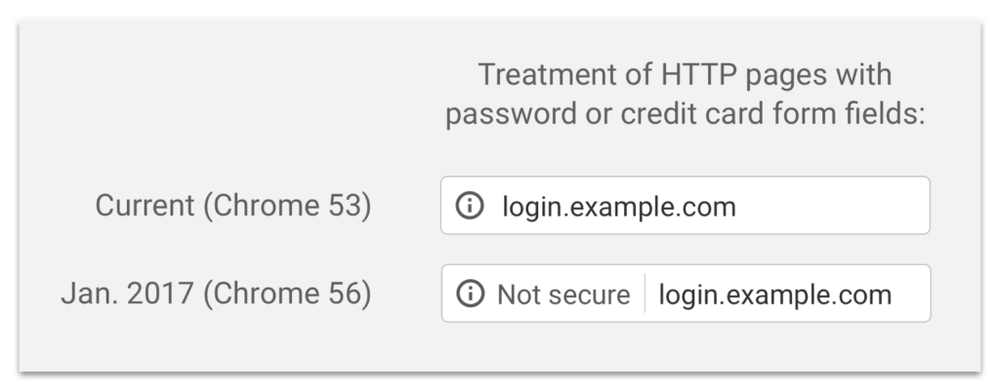

Depuis la sortie de Chrome 56 (qui devrait arriver dans quelques jours), Google va dénoncer les sites internet qui récoltent des mots de passe ou des numéros de carte de crédit comme non sécurisés s'ils sont servis via HTTP.

C'est une nouvelle énorme, car elle va obliger pratiquement tout le monde à basculer vers HTTPS. Le but de Google a toujours été de fournir un web meilleur et plus sécurisé pour les utilisateurs. Je pense que c'est une bonne chose qu'un tel géant prenne position pour imposer de telles mesures. Mais la chose la plus importante n'est pas forcément d'entraîner les dévelopeurs à servir des pages sécurisées, mais plutôt d'apprendre aux utilisateurs à ne plus faire confiance à des sites non sécurisés. C'est la raison pour laquelle Chrome va renforcer progressivement cette notification pour qu'elle apparaisse au final avec un triangle rouge, un peu comme les sites dont le certificat est cassé.

Le HTTPS devient de moins en moins cher, et avec des services comme Let's Encrypt, il n'y aura bientôt plus aucune raison de ne pas servir des sites en HTTPS. Ce qui m'amène à penser que je devrais ajouter un certificat à mon site.

---

Source : [Google Blog](https://security.googleblog.com/2016/09/moving-towards-more-secure-web.html?m=1)
