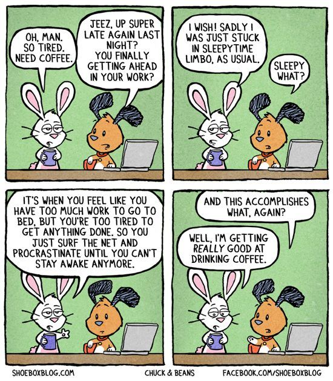

A couple of months ago I bought myself a [Pebble](https://www.pebble.com/). It's a nifty little device which acts as an extension to my phone, directly strapped to my wrist. Thanks to it I can quickly send pre-recorded messages with the press of a few buttons, but most importantly get notifications on new messages, them being emails, SMS or even Telegram messages. Which can get a bit invasive especially when my friend Edouard spams me with Wu-Tang Clan lyrics. All in all, it's really an amazing gadget and I'm really happy with it.

Another cool feature is its ability to track sleeping patterns. Thanks to its built-in gyroscope, it can detect wrist movements and deduce if I'm sleeping or not. Granted, it's not 100% bullet-proof, but it does a good job at giving a broad idea of how good (or bad) my sleeping habits are. And boy they are terrible.

According to my Pebble, I sleep 7 hours 3 minutes per night on a 30 days average, with an average deep sleep duration of 1h 48m. It's not *that* bad, but when you take into account that during a same week I can sleep from 3h 55m one day to 9h 18m another, there's clearly something really wrong with my sleep schedule.

My usual "worst" night is the one from sunday to monday, with an average of 5 hours of sleep. My "best" night is usually the one from saturday to sunday, with up to 11 hours (!) of sleep.

The average human needs [between 7 and 8 hours of sleep](https://sleepfoundation.org/sites/default/files/SleepTimeRecommendations012615%5B1%5D-page-001_0.jpg) for optimal functions, which means I have a [sleep debt](http://www.health.harvard.edu/staying-healthy/repaying-your-sleep-debt) of about 30 minutes to an hour *per day*. That's a cumulated debt of about 4-5 hours per week. On the long run, such deprivation is the cause of stress, weight gain, fatigue, and even diabetes. If you need more info on the benefits of sleep, I highly suggest you [read this article](https://pillowpicker.com/health-wellbeing/benefits-of-sleep/) from Pillow Picker.

> "But Fabien, all you need to do is go to sleep one hour earlier, that's all!"

Yeah, that's not taking into account the absolutely amazing capacity of the human brain to slack off.

Getting more sleep has been a goal of mine for 2017. I've already taken some steps towards this, removing my tablet from the nightstand and replacing it with [a good book](https://www.amazon.com/dp/1421586207/). But I still need to slap myself on the wrist and stop spending my evenings reading about code or cruising around [Tamriel](https://en.wikipedia.org/wiki/The_Elder_Scrolls_V:_Skyrim) or [Dust2](https://en.wikipedia.org/wiki/Counter-Strike:_Global_Offensive).

I hope to write an addendum to this post soon, describing how my sleep habits have changed, if I ever manage to change them. In the mean time, I'm off to take a nap.
