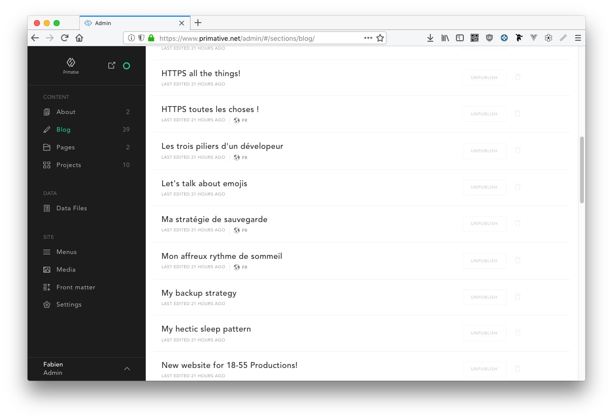
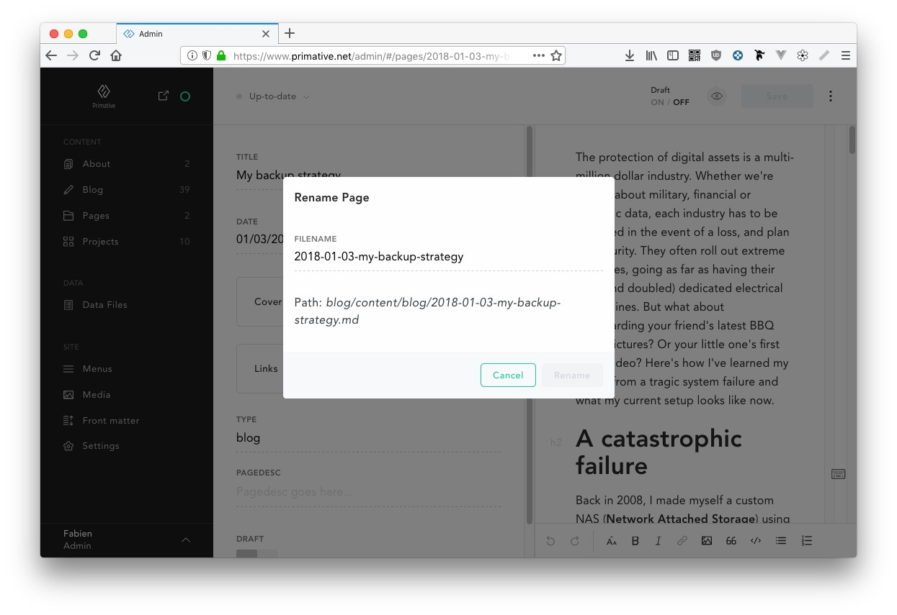
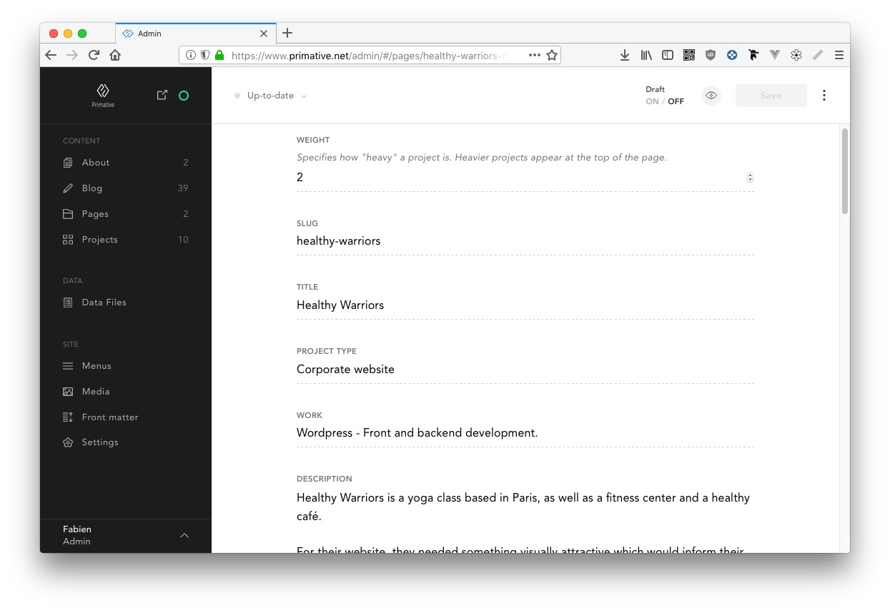

Les sites internet statiques sont de plus en plus poulaires, offrants une plus grande vitesse d'affichage, une meilleure commodité d'utilisation et une sécurité plus solide. Mais qu'en est-il lors de l'utilisation d'un tel système dans "le monde réel", où un client veut quand même avoir la main sur le contenu de son site internet ? Pour cela nous avons besoin d'une UI. Voici mon premier avis sur Forestry, un CMS fait pour les sites statiques.

<!--more-->

L’utilisation de sites internet statiques se répand de plus en plus sur le web. Au delà d’un “retour aux sources” numérique, ces systèmes ont de multiples avantages. Ils sont en effet souvent plus rapides, car ils se limitent à servir des pages web simples, sans travail côté serveur. La logique est laissée à la charge du client, le plus souvent par le biais d’API, et il est beaucoup plus facile de mettre en cache et d’utiliser un CDN lors du déploiement. Ces derniers sont d’ailleurs atomiques, avec une invalidation de cache instantanée. La délivrabilité du site est ainsi assurée à 100%. Les sites statiques sont aussi souvent beaucoup plus sécurisés étant donné qu’ils ne permettent pas l’envoi direct d’informations au serveur.

Néanmoins, la mise à jour et le déploiement d’un site statique se fait obligatoirement par le biais d’une machine qui bénéficie d’un environnement de développement idoine. Un terminal et des outils comme Git, Node, NPM, Ruby, et autres sont parfois nécessaires. Le site doit en effet être recompilé, soit en amont, soit par un système automatisé comme GitHub Pages ou Netlify.

## De l’utilité d’un CMS statique

L’intérêt d’utiliser un CMS pour un site statique devient donc pertinent pour plusieurs raisons. Premièrement cela permet de s’affranchir de cet environnement de développement. Dans le cas d’un blog, la création d’articles devient beaucoup plus fluide, et le fait de pouvoir se détacher de cet environnement technique permet un meilleur workflow du processus de création de contenu. Ensuite, cela permet à des utilisateurs non techniciens de pouvoir prendre la main sur leur site et de leur laisser libre court à la création et la gestion de contenu éditorial.

Aujourd’hui je m’intéresse à Forestry, un service hébergé qui utilise l’API GitHub pour permettre à un site statique d’être géré à distance.

## Installation

L’installation du CMS est extrêmement simple : j’ai dû créer un compte sur le site de Forestry, le lier à mon compte GitHub et choisir le dépôt du site en question. Il suffit ensuite de spécifier si le site est généré par Hugo (ce qui est mon cas) ou par Jekyll. Petite note au passage : j’ai dû préciser la version de hugo que j’utilise, et celle proposée par Forestry ne correspondra pas forcément à la votre. Cela ne m’a pas posé de problème car j’ai configuré Forestry pour qu’il ne gère pas la  génération de mon site, mais c’est un détail qui peut avoir son importance.

## Configuration

La configuration de Forestry est toute aussi simple que son installation car le système va automatiquement naviguer dans le dépôt et va générer les types de contenu en fonction de ce qu’il trouve. Il m’a fallu ainsi cinq minutes pour avoir un backoffice fonctionnel et être tout de suite productif.

Il est même possible de venir greffer le CMS sur son propre site, et passer par une URL que l’on va spécifier (par exemple [www.exemple.com/admin](http://www.exemple.com/admin)), ce qui permet de ne jamais quitter son propre site internet.

## Utilisation

Forestry fonctionne grâce à l’API de GitHub, Gitlab ou Bitbucket. C’est un CMS très pratique à utiliser avec une interface claire. À gauche, un panneau listant les types de contenu permet d’accéder aux différentes catégories du site, et à droite, un panneau type Wordpress donne accès aux champs à remplir ainsi qu’à l’éditeur de texte principal.

Dans mon cas, Forestry a fait un travail impeccable pour trouver mes articles de blog et mes projets, mais il a été un peu plus limité pour trouver le contenu des pages. Ainsi, pour une raison inconnue, le système a fait la différence entre la page d’accueil et la page “À propos”, et ces deux pages sont considérées comme deux sections différentes.

À noter que malgré l’utilisation de l’API GitHub, il n’est pas possible pour l’instant d’accéder à l’historique des contenus. Il m'a cependant été possible de renommer le fichier (généré automatiquement par le CMS) afin de pouvoir bénéficier de la gestion du multi-langue de Hugo. Ainsi, en ajoutant simplement l’extension `.fr` à un slug existant, j’ai pu laisser Hugo lier automatiquement deux articles et proposer la version traduite aux visiteurs.

Dans mon cas, un projet est configuré exclusivement grâce à l’utilisation du Front Matter. En modifiant une ou deux lignes du fichier de configuration, j’ai pu me débarrasser de l’éditeur de texte afin de me retrouver exclusivement avec les champs de configuration d’un projet. Pour les utilisateurs de Wordpress, cela revient à avoir une page composée à l’aide d’Advanced Custom Fields, mais générée grâce à un fichier YAML.

## Avantages / Inconvénients du CMS

Le premier inconvénient, qui saute aux yeux dès la première utilisation du CMS, est le côté “technique” qui reste très présent et ce malgré l’utilisation d’une interface graphique. Il faut maîtriser le nommage de fichiers afin de permettre à Hugo de s’y retrouver, et il y a parfois certains aspects qui pourraient effrayer les utilisateurs.

Il aurait été judicieux de permettre le nommage automatique et silencieux des fichiers d’articles par l’utilisation d’un système de slug spécifié dans un fichier de configuration, et confier la bascule de la langue via un champ de sélection dans l'interface.

L’ajout de comptes “utilisateurs” avec restriction de droits est réservé à l’offre payante “Business” qui est à $9 par mois et par utilisateur. Dans sa version gratuite, il est possible d’ajouter des comptes “invités” qui ont pratiquement tous les droits sur le site, ce qui peut être très problématique.

Il faut savoir par exemple que Forestry impose l'utilisation du format TOML pour le Front Matter et les fichiers de configuration d'un site généré par Hugo. Dans mon cas, Forestry a détecté des “menus” pour les projets, qui ne sont pas du tout utilisés. En voulant faire un test et en modifiant l’ordre des projets, il a décidé de réécrire 47 fichiers, y compris le fichier de configuration globale de Hugo (en écrivant du TOML dans un fichier YAML), ce qui m’a complètement bloqué le build. J’ai dû passer par Git pour défaire les modifications et revenir à une version antérieure qui était fonctionnelle.

Pour l’aspect technique, il faut considérer le fait que Forestry utilise l’API GitHub et va donc générer une multitude de commits qui ne vont certainement pas respecter votre convention. Si c’est un point crucial pour vous, cela peut être problématique.

## Conclusion

Après avoir écrit ceci, on pourrait penser que je n'ai pas apprécié Forestry mais c'est tout le contaire. Le système possède quelques lacunes évidentes, certes, mais l'équipe qui travaille dessus est constament en train de l'améliorer. Ceci étant dit, et lorsqu’on considère sa rapidité d’installation et sa souplesse d’utilisation, je pense que Forestry est un choix solide comme système de gestion de contenu pour un site statique. Il permet ainsi de retrouver une certaine souplesse à l’administration d’un site internet tout en continuant de bénéficier de tous les avantages de rapidité, de sécurité et d'optimisations qu’offrent l'utilisation d'un générateur de sites web statiques.
